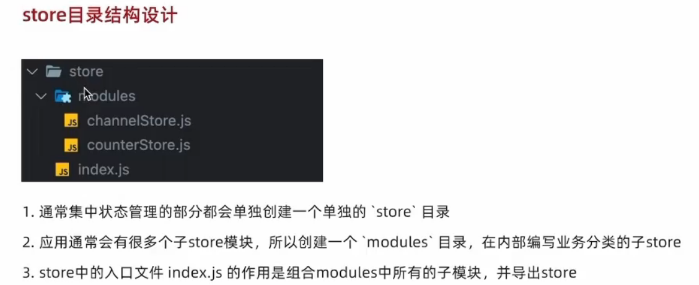
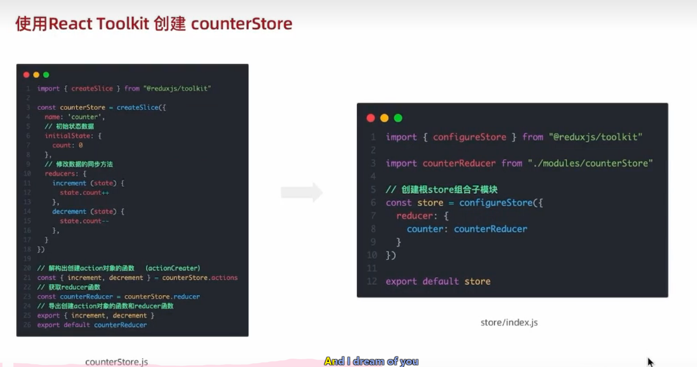
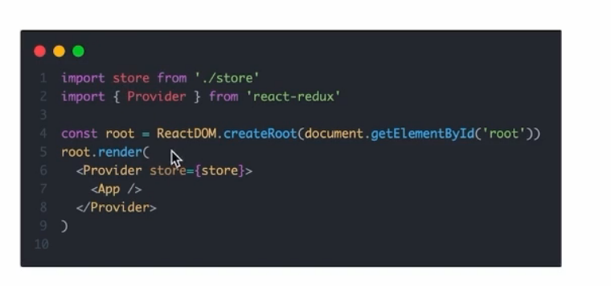
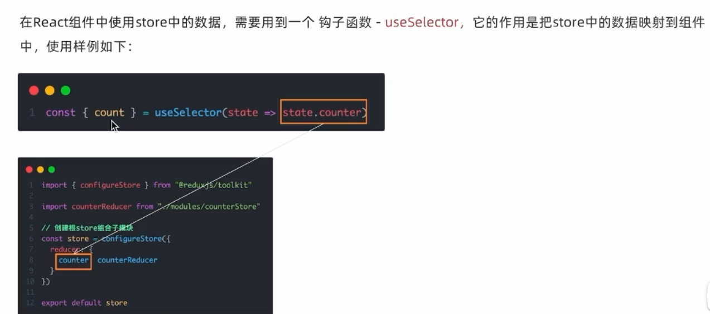
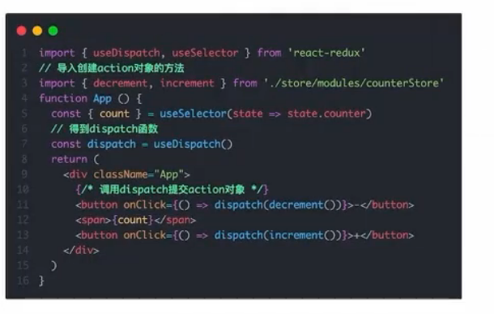

## 开发环境搭建
1. 创建 npx create-react-app 项目名字 (这个是webpack)
2. cd 项目名
3. 启动 进入到文件目录后 npm start
### 渲染过程
index.js为入口文件，引入了APP.js根组件，再将根组件渲染到public里面的index.html的id为root的dom元素中
## JSX
js+html
### js表达式
在里面的html结构中，可以用{}识别js表达式，如用引号传递字符串，使用变量，调用函数或者方法，使用对象
#### 注意事项
return的时候，jsx只能有一个根元素，如果要有多个，可以使用空标签<></>，但是如果我想要加key，那么使用Fragment标签在上面加key
### 循环渲染
map方法，return回来结构，注意要有一个key
### 条件渲染
1. && 与
2. a?b:c
3. 通过ifelse语法把规范内容，然后再把内容插入
### 事件绑定
#### 初始
```jsx
const handleClike=()=>{
    console.log('abc')
}
<button onClick={handleClick}>click me<button>
```
#### 访问事件参数e
```jsx
const handleClike=(e)=>{
    console.log('abc',e)
}
<button onClick={handleClick}>click me<button>
```
#### 传递自定义参数
```jsx
const handleClike=(name)=>{
    console.log('abc',name)
}
<button onClick={()=>handleClike('gh')}>click me<button>
```
注意这里要改成箭头函数
#### 既要事件参数e ,又要自定义参数
```jsx
const handleClike=(name,e)=>{
    console.log('abc',name)
}
<button onClick={(e)=>handleClike('gh',e)}>click me<button>
```
## 组件
1. 定义组件(定义函数)函数首字母大写，return出来一个结构{}
2. 在需要组件的地方把函数名当作标签使用
## useState
一个函数，可以让数据变化时，视图也跟着变化，useState为一个函数，调用时返回一个数组，第一个参数为数据，第二个参数是set函数用来修改前面的数据，传给useState的参数为第一个参数的初始值`const [count.setCount]=useState(0)`
1. 从react引入 import {useState} from 'react'
2. 之后写对应的回调函数，这里以一个按钮点击自增为例，回调函数里面调用set函数，这里回调函数不能直接写set函数，我也不知道为啥？有时候也可以写？存疑 
### 规则
状态只能通过set函数替换，不能修改，无论简单类型还是复杂类型(对象)都是要写一个新的直接替换，不要出现等号这种修改的，但是我们可以在开始写...data，展开之前的属性，然后再写要改的属性
### useState实现双向绑定
1. 让input的value值和useState的value绑定上（react改可以推动视图改）
2. 添加事件onChange，`onChange={(e)=>(setValue(e.target.value))}`,是的视图改能推动react改
## 样式控制
1. 行内，不推荐，也可以放一个对象名
2. 引入，import一个css，标签上的属性用className替换class。
## useRef 获取dom对象和保存值
获取对象
```jsx
//1.使用useRef函数生成ref对象并绑定在dom标签上
const inputRef=useRef(null)
<input type="text" ref={inputRef}/>
//2.dom可用时，ref.current获取dom
inputRef.current
```
保存以前的值
```jsx
const pre = useRef()
pre.current=count//可以在每次更新count的时候把count的值保存下来，如果用一个普通变量来接收就没反应
```
获取子组件,能够让父组件访问子组件的方法
```jsx
//1. 在使用的子组件上写上ref
<Child ref={childRef} />
//2. 在子组件的定义上做些改变
const Child=forwardRef(function(prop,ref){
	useImperativeHandle(ref,()=>({
		//暴露出去的方法
		myFn:()=>{
		
		}
}))
})
```
## 组件通信
### 父传子
1. 父传递：在父组件的页面上，在子组件的标签上写上类似`name={'gh'}`,这种的
2. 子接受：在函数的形参位置写上props，props就是传过来的所有信息  
* 说明：可以传多个，传啥都行但子组件不能改  
* 特殊的props，如果在子组件标签里面写东西，里面的内容会自动被放到props里面的children属性里面去
### 子传父 
核心：子组件调用父组件中的函数并传递实参  
1. 父给子传递函数
2. 子接受(可以解构赋值，也可以用props)，并调用函数传递子的信息
3. 父用一个useState维护信息，在函数里面实时更新就可以渲染到父组件上
### 兄弟通信
利用状态提升机制，把子组件的数据状态提升到共同的父组件，利用父子通信传递信息
### 跨层通信(父传子)
```jsx
//1. 利用createContext来创建一个上下文对象
import {createContext} from 'react'
const ctx = createContext('msg')
//2. 在顶层组件上通过类似 ctx.Provider 的标签来传递值
//这个组件包裹在子组件外
<ctx.Provider value={'msg'}>
    <A></A>
</ctx.Provider>
//3. 底层组件通过useContext()函数来接受信息
const msg=useContext(ctx)
```
## useEffect
用来创建不由事件触发而是由渲染本身触发的操作，比如发送ajax请求
```jsx
//第一个位置叫做副作用函数，里面存放要执行的操作，第二个位置为一个数组，数组不同会引起副作用函数的执行
useEffect(()=>{},[])
```
### 第二个位置取值的说明
1. 啥也没有，在初始渲染完成后和组件更新时执行副作用函数
2. 有一个空数组，在初始渲染完成后执行
3. 数组里面有特定的依赖项，在初始渲染完成后和特定依赖项变化时执行
### 清除副作用
由渲染引起的与组件外部联系的操作，也叫副作用操作，有时候我们卸载了组件但里面的操作并没有停止，这个时候需要return一个函数用来结束操作，最常用的时机是在组件卸载时自动执行
```jsx
useEffect(()=>{
    return ()=>{
        //清除副作用逻辑
    }
},[])
```
## 自定义hook函数
抽取部分代码，抽象成函数，提高可复用性
1. 声明use开头的函数
2. 在函数体内封装可复用逻辑
3. return出去状态和回调函数
4. 在需要用这个函数的组件内解构出来状态和回调函数进行使用
## ReactHooks使用规则
1. 只能在组件内或者自定义hook函数中使用
2. 不能嵌套在if for 或者其他函数中
## redux react中的pinia
### 独立使用步骤(记得引入js文件)
...好麻烦我先不写哈哈哈哈哈哈哈哈哈  
state存放数据状态，action描述怎么改数据，reducer根据action的描述返回一个新的state
### 配合react使用
1. 创建react项目
2. 安装配套工具 npm i@reduxjs/toolkit react-redux Redux-Toolkit(简化书写)，react-redux链接redux和react组件
3. 启动项目
#### 具体实现
1. 首先来建结构一般结构如下  
2. 具体代码如下  
3. 通过react-redux把redux和react链接起来，通过store属性传入示例，具体代码如下在总的index.js里面写的
4. 在组件中使用store中的数据  
5. 修改  
   操了怎么这么复杂...
## useReduer 统一状态管理
在使用useState的时候，我们的setxxx里面的逻辑是多种多样的，并没有做一个统一，这时候我们可以用useReduer把这些逻辑封装在一个函数里面，使得代码更加清晰
```react
//自定义函数 接收2个参数 状态值 对状态的处理
function conuterReducer(state,action){
	//处理
}
//四个参数为 状态值 修改状态的触发器 自定义的处理函数 状态的初始值
const [state,dispatch] = useReducer(counterReducer,0)
//封装处理 参数实际上就是你要传给action的东西
const handleData =()=>dispatch({type:"increment"})
```
## useMemo 缓存数据功能
在父组件更新时，子组件也会更新，但是如果父组件的更新并不会在结果上影响子组件，我们可以缓存子组件的结果，防止浪费性能
```jsx
const res=useMemo(()=>{
	return res;
},[value])
//后面的依赖项里的内容表示只有value变化时才会触发
```
## useCallBack 缓存函数功能
同样还是子组件会随父组件更新而更新的功能，这时我们可以用memo方法把组件变为记忆组件，如果传入的prop一样就不会更新，可问题又出现了，如果子组件使用了父组件传入的函数，那么父组件更新一遍，js会认为前后的两个函数不是同一个函数，这时我们需要用useCallBack去缓存函数
```jsx
//1. 子组件变为记忆组件
const Button = memo(function({onClick}){
	//xxx
})
//2. 缓存函数
const handleClick = useCallBack(()=>{
	//原来的函数
},[]);
```
## react router
下载：npm i react-router-dom
### 项目的布局
1. 在src下新建page文件(类似vue的views)，之后在下面新建每个页面的模块，比如Home文件，再在里面新建index.js，之后在index.js里面默认导出
2. src下新建router文件夹，再在里面新建index.js，导入相应的模块
3. 在index.js中引入方法，调用方法并用路由实例接收，最后默认导出
```jsx
import {createBrowserRouter} from 'react-router-dom'
const router = createBrowserRouter([
	{
		path:'/login',
		element:<Login/>//引入的模块名
	},
	{
	
	}
])
```
4. 在index.js里注入router示例
```jsx
const root = ReactDOM.createRoot(document.getElementById('root'));
root.render(
    <RouterProvider router={router}> </RouterProvider>
);
```
### 路由导航
1. 声明式导航
```jsx
import {Link} from 'react-router-dom'
<Link to="/login"></Link>
```
2. 编程式导航
```jsx
import {useNavigate} from 'react-router-dom'
const navigate=useNavigate()
//navigate('/login') 里面填写路径就可以跳转了
```
声明式导航更适合于菜单，编程式一般会写在js代码里作为逻辑使用
### 路由传参
1. searchParams传参
	1. 传递：在路径的后面加参数如`/login?id=1&name=jack`
	2. 接收：
```jsx
	import {useSearchParams} from 'react-router-dom'
	const [params]=useSearchParams()
	let id=params.get('id')
```
2. param传参
	1. 传递：在路径后面直接加数据`/login/1001`，之后去路由配置文件在路径后面加占位符如`path:'/login:id'
	2. 接收：
```jsx
import {useParams} from 'react-router-dom'
const params=useParams()
let id=params.id
//如果想要传递多个，路径多加一个参数就行 如/login/1001/jack，配置文件变成path:'/login:id/:name
```
### 嵌套路由
1. 在路由配置文件中配置children属性
2. 在父级路由的组件中配置子级路由的渲染位置，使用<Outlet />
```jsx
const router = createBrowserRouter([
	{
		path:'/login',
		element:<Login/>//引入的模块名
		childlen:[
			{
			
			},
			{
			
			}
		]
	},
	{
	
	}
])
```
默认二级路由：去掉子路由的path属性，改为index:true，这样访问1级路由时自动渲染2级路由
### 404路由
在路由表的最后，准备一个404组件，path:'*'
## Mobx
安装：yarn add mobx mobx-react-lite  
项目位置：依然是src下新建store，在store里新建如counter.js   
创建仓库：

1. 定义类，定义类里面的数据和修改方法
2. 导入方法，让数据变成响应式
3. 实例化并导出
```jsx
import {makeAutoObservable} from 'mobx'
class CounterStore{
	count=0
	addCount=()=>{
		this.count++
	}
	constructor(){
		makeAutoObservable(this)
	}
}
//const counterStore=new CounterStore()
//export {counterStore}
export default CounterStore
```
具体使用：
1. 导入store使得能够拿到数据
2. 导入方法使得变成响应式变化
```jsx
import {observe} from 'mobx-react-lite'
import {counterStore} from ''
function App ()=>{
	return (
		{counterStore.count}
	)
}
export default observe(App)
```
### 声明计算属性
```jsx
get 方法名(){
	//xxx
}
//在别的组件里面用的时候不要写方法后面的括号，就当成属性用
```
### 模块化
分出很多store，然后组装再导出
```jsx
import {React} from 'react'
//新建index.js
//1. 引入子store
import 
//2. 声明RootStore
class RootStore{
	constructor(){
		//实例化子模块，将实例化的子模块挂载到根store的属性上面
		this.counterStore=new CounterStore()
	}
}
//3. 模板代码其实我不明白
const rootStore=new RootStore()
const context = React.createContext(rootStore)
const useStore=()=>React.useContext(context)
export {useStore}
```
以后所有的组件直接引入useStore，让每个业务组件通过一样的方法获取store
### mobx和react的职责划分
mobx：
1. 业务状态数据
2. 操作业务状态逻辑
react：
1. 渲染业务数据
2. 维护ui(交互)的临时状态
3. 调用mobx里面的事件
## 配置别名路径
1. 使用插件 yarn add -D @craco/craco
2. 在项目根目录中创建 craco 的配置文件：craco.config.js
```js
const path = require('path')

module.exports = {
  // webpack 配置
  webpack: {
    // 配置别名
    alias: {
      // 约定：使用 @ 表示 src 文件所在路径
      '@': path.resolve(__dirname, 'src')
    }
  }
}
```
3. 修改 package.json 中的脚本命令
```js
// 将 start/build/test 三个命令修改为 craco 方式
"scripts": {
  "start": "craco start",
  "build": "craco build",
  "test": "craco test",
  "eject": "react-scripts eject"
}
```
### 别名路径提示
1. 在项目根目录创建 jsconfig.json 配置文件
```js
{
  "compilerOptions": {
    "baseUrl": "./",
    "paths": {
      "@/*": ["src/*"]
    }
  }
}
```
## 路由鉴权(说人话就是看有无token)
在components里建的AuthComponent.js
```js
// 1. 判断token是否存在
// 2. 如果存在 直接正常渲染
// 3. 如果不存在 重定向到登录路由

// 高阶组件:把一个组件当成另外一个组件的参数传入 然后通过一定的判断 返回新的组件
import { getToken } from '@/utils'
import { Navigate } from 'react-router-dom'

function AuthRoute ({ children }) {
  const isToken = getToken()
  if (isToken) {
    return <>{children}</>
  } else {
    return <Navigate to="/login" replace />
  }
}

// <AuthComponent> <Layout/> </AuthComponent>
// 登录：<><Layout/></>
// 非登录：<Navigate to="/login" replace />

export { AuthRoute }
```
## CAR配置sass环境
内置了sass的配置，只需要`yarn add sass`就ok，注意文件后缀为sass
## 获取路径
```jsx
import {useLocation} from 'react-router-dom'
const location = useLocation()
//location.pathname可以访问到路径
```
## 组件设置成中文
index.js
```jsx
import React from 'react';
import ReactDOM from 'react-dom/client';
import './index.scss'
import { RouterProvider } from 'react-router-dom';
import router from './router/index.js'
import { ConfigProvider } from 'antd';
import locale from 'antd/locale/zh_CN'
const root = ReactDOM.createRoot(document.getElementById('root'));
root.render(
  // <React.StrictMode>
  <ConfigProvider locale={locale}>
    <RouterProvider router={router}></RouterProvider>
  </ConfigProvider>
  // </React.StrictMode>
);

```
## 富文本编辑器
`yarn add react-quill`
## 项目打包
1. 安装分析打包体积的包：yarn add source-map-explorer
2. 在 package.json 中的 scripts 标签中，添加分析打包体积的命令
```json
"scripts": {
  "analyze": "source-map-explorer 'build/static/js/*.js'",
}
```
3. 对项目打包：yarn build（如果已经打过包，可省略这一步）
4. 运行分析命令：yarn analyze
5. 通过浏览器打开的页面，分析图表中的包体积