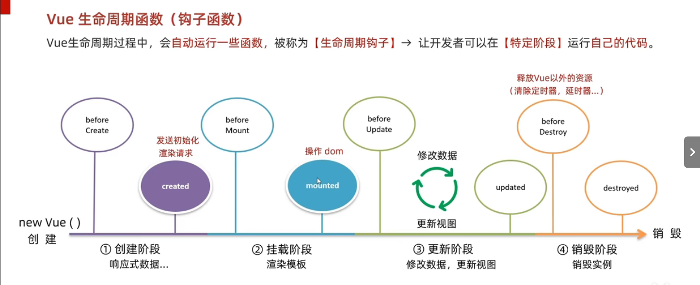
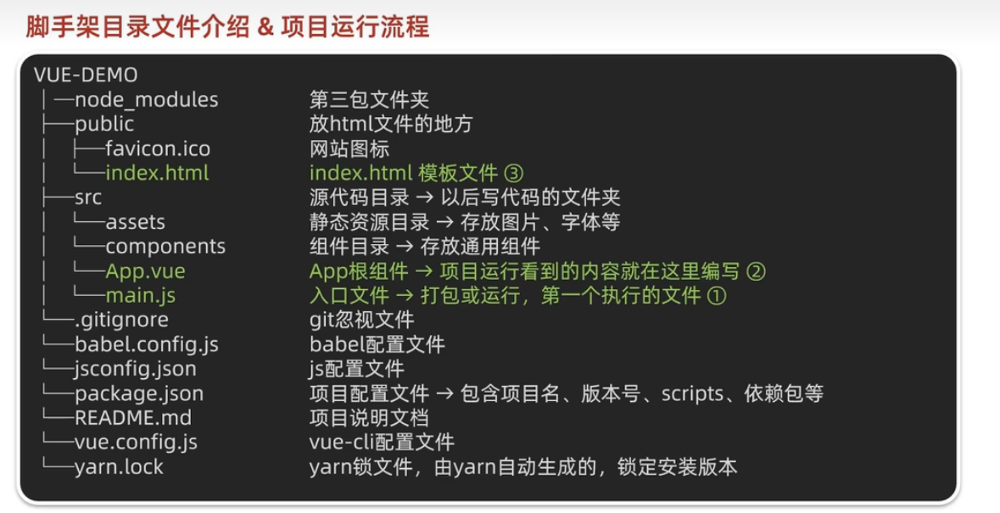
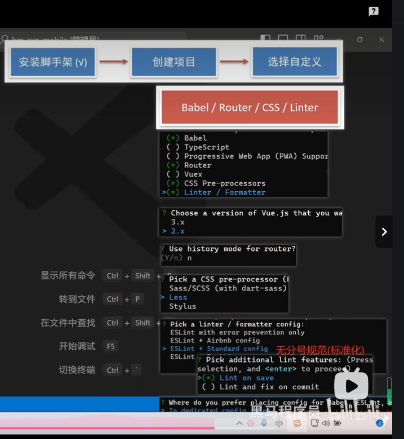
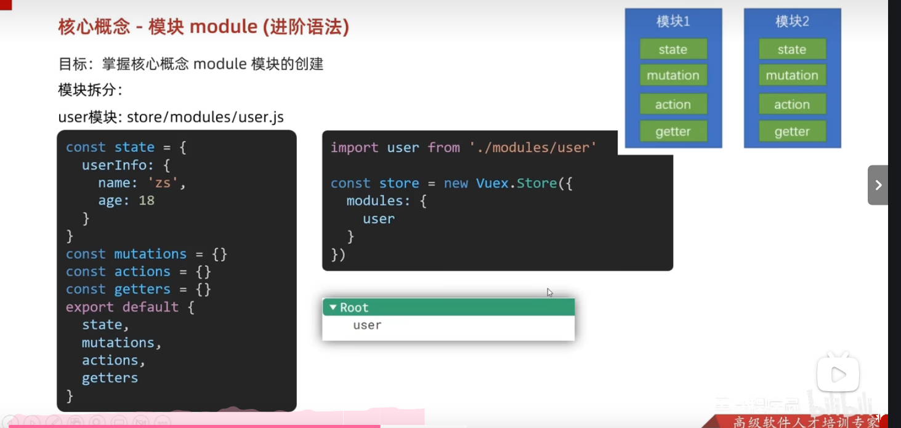

## 概念：vue是一个构建用户界面的渐进式框架
### 创建vue实例
1. 准备一个容器(盒子)
2. 引入vue 开发版本包：<script src="https://cdn.jsdelivr.net/npm/vue@2.7.14/dist/vue.js"></script>
3. 创建vue实例
4. 指定配置项，在new Vue后面写东西渲染数据，分为el和data，el后面写选择器，而data后面写提供的数据，methods提供
```js
<script src="https://cdn.jsdelivr.net/npm/vue@2.7.14/dist/vue.js"></script>
<div id="app"></div>
const app=new Vue({
    el:'#app',
    data:{
        msg:'hi'
    }
})
```
### 插值表达式 {{}}
利用表达式进行插值，渲染到页面中  
语法：{{表达式}}  
注意：
1. 使用的数据必须存在
2. 不支持语句如if等
3. 不能在标签属性中使用{{}}插值，换句话说，插值表达式里面的是内容，是给别人看的
### Vue核心特性：响应式
数据变化，视图自动更新，比如我修改了app中msg的值，在网页上就会自动更新  
事实上，data中的每个值，都已经是实例的属性  
访问：实例.属性名
修改：实例.属性名=值
### Vue指令：带有v-前缀标签的特殊属性 是属性就跟什么url class一样的
1. v-html="表达式"，动态设置元素的innerHtml，相比起插值表达式，其优势在于可以解析标签
2. v-show="表达式"，控制元素的显示隐藏，表达式结果为true，就显示，反之隐藏，底层原理：通过css添加display:none来控制显示隐藏，适合频繁显示隐藏的场景
3. v-if="表达式"，控制元素的显示隐藏(条件渲染)，表达式结果为true，就显示，反之隐藏，底层原理：基于条件判断是创建还是移除元素节点，适合不频繁切换的场景
4. v-else，需要紧挨着v-if使用，如果v-if里面为false，就执行v-else
5. v-else-if="表达式"，需要紧挨着v-if使用，再次做if判断
6. 1. v-on:事件名="执行的语句",注册事件
```html
<button v-on:click="count++"></button>
//也可以简写，以后用简写更多
<button @click="count++"></button>
```
   2.  v-on:事件名="methods中的方法"，也可以简写，另外也可以传参，加一个括号就就可以，但是注意在methods里面的方法是不可以直接使用data里面的数据的，所以我们可以用实例.属性名来访问，但是当实例名字改变的时候，里面的methods也需要变化，所以出现了this，methods里面的this指向实例对象，以后用this.属性名
7. v-bind:属性名=表达式，动态设置html的标签属性，也可以简写，为:属性名=表达式，也可以加对象{类名：true/false}，
8. v-for="(item,index) in 数组",基于数据循环，多次渲染，理解的是，有一组数据(数组，对象，数字)需要将他们都渲染，这样我们可以开一个循环，可以简写v-for=item in 数组"***注意***：用v-for时，必要时要加key(用v-bind)，key本质是一个属性，key是给元素添加的唯一标识，具有唯一性，推荐用id，如果不用key的话，v-for会尝试原地复用，比如有四个数据，删掉第一个，v-for会尝试删除掉最后一个并且把后三个内容复制到前三个中，第一个数据并没有被删掉
9. v-model="变量"，给表单元素用，快速获取或者设置表单的元素内容，可以让数据和表单实现双向数据绑定，如何理解呢？在前面我们说过响应式，指的是数据变化，视图自动更新，而双向除了这个特性外还有一个视图变化了，数据也会自动更新
### 指令修饰符 简化代码
1. *频率高* @keyup.enter="执行的语句或方法"，.enter就是一个指令修饰符，keyup会在摁下任意键后触发事件，而加上.enter后,keyup就会控制只有在摁下回车后才会执行,另外,当方法没有传参时,方法里可以接受一个参数时事件对象e,和原生js的事件对象一样
2. v-model.trim="变量",自动清除表单首尾的空格
3. v-model.number="变量",将数据转换为number类型,如果转不了就不转
4. 事件名.stop,阻止冒泡(子到父)
5. 事件名.prevent,阻止默认行为
### v-bind对于样式控制的增强-操作class
1. :class="对象",布尔值为true,就有这个类,反之没有这个类,适合一个类名来回切换
```html
<div :class="{类名1:布尔值,类名2:布尔值}"></div>
```
2. :class="数组",全部添加
```html
<div :class="['类名1','类名2']"></div>
```
### v-bind对于样式控制的增强-操作style
```html
<div :style="{css属性1:'值',css2:'值'}"></div>
```
强大之处在于单独控制单个标签,另外如果有复合属性,可以用小驼峰写法也可以用引号把属性引用起来
### v-model应用其他表单
1. 输入框,文本域:需要一段话
2. 单选框,true,false
3. 复选框,value
4. 下拉菜单,value,选中option的value值是select的value值
### 计算属性
基于现有的数据,计算出来的新属性,如果依赖的数据变化了将自动重新计算   
声明在computed配置项中(和data,methods并列),一个计算属性对应一个函数,使用时放在{{}}里,但不能加括号,computed里可以用this去访问数据
```js
computed:{
    计算属性名(){
        计算过程
        return 结果
    }
}
<div>{{计算属性名}}</div>
```
### computed计算属性和methods方法
computed:侧重结果,直接使用,this.计算属性,{{计算属性}},但computed有缓存特性(\提升性能),计算属性会对计算出来的结果进行缓存,再次使用直接读取缓存,如果数据变化就自动重新计算并且再次缓存.             
methods:提供方法,作为方法需要调用,this.方法名(),{{方法名()}},@事件名="方法名"
### 修改计算属性
上面写的是计算属性的简写，只能读取访问不能修改，如果要修改需要写完整
```js
computed:{
    计算属性名:{
        get(){
            计算逻辑
            return 结果
        },
        set(形参 接收修改的值){
            修改逻辑
        }
    }
}
```
### watch侦听器（监听器）
watch监听数据变化，在数据变化时执行函数  
在想要监视的数据外写一个与data并列的watch
```js
//该方法会在数据变化时调用
watch:{
    //想监听data下的一级
    word(newValue,oldValue){
        执行语句
    },
    //如果想监听的数据还被对象包裹,用路径去访问，然后加上引号
    'obj.words'(newValue){
        执行语句
    }
    //很多时候我们不需要以前的数据，所以我们可以只写一个形参来接受新的值
}
```
### watch的完整写法
相比起简便写法，完整写法增加了两点，
1. 可以对复杂数据类型监视，比如可以监视一个对象，对象里面任意一个值发生变化就会去执行相应的语句(深度监视)
2. 除了在数据变化时执行相应语句，还可以在初始界面立即执行一次
```js
watch:{
    数据属性名:{
        deep:true//深度监视
        immediate:true//立即执行
        handler(newValue){
            执行语句
        }
    }
}
```
### Vue生命周期
一个Vue实例从创建到销毁的整个过程
生命周期包括4个阶段：
1. 创建，将普通的数据处理成响应式的数据
2. 挂载，渲染到页面
3. 更新，修改数据，更新视图
4. 销毁，关闭浏览器、
### Vue生命周期函数(钩子函数)
Vue生命周期中，会自动运行一些函数，被称为生命周期钩子，我们可以在对应的函数里面去写一些想要执行的语句
  
### 利用脚手架创建一个demo及文件介绍
在想要创建demo的地方摁住shift之后鼠标右击，选择在Window PowerShell中打开，之后创建输入 vue create projectname(不能有中文)   
文件的解释
    
### 组件化开发-局部注册:只能在注册的组件中使用
可以先删除原有的asssets和components
1. 在src下创建一个components文件
2. 在这个文件里面利用大驼峰命名法注册.vue文件，包括三个组成部分，结构、样式、逻辑，有快捷键<vue 回车
3. 在使用的组件里面的逻辑里引入组件
```js
import 组件对象名 from 'vue文件路径'
import HmHeader from './components/Hmheader'
```
4. 局部注册
```js
export default{
    components:{
        '组件名':组件对象
         HmHeader:Hmheader,
         //在前后相同的基础上可以简写
         HmHeader
         //可以一下子注册多个
    }
}
```
使用的时候当成html标签来使用 <HmHeader></HmHeader>,也有简写,先写上组件名之后摁tab   
一般都用局部的，发现局部组件再抽离到全局
### 全局注册:所有的组件都能使用
1. 同上面2
2. 在main.js中进行全局注册,在顶部写
```js
import HmButton from './components/HmButton'
//调用Vue.component 进行全局注册
//Vue.component('组件名',组件对象)
Vue.component('HmButton',HmButton)
//这个一次只能注册一个
```
使用的时候当成html标签来使用 <HmHeader></HmHeader>,也有简写,先写上组件名之后摁tab
### vue2 组件的三大组成部分的一些注意说明
1. 结构中只能有一个根元素
2. 默认时，写在组件中的样式会全局生效，容易造成多个组件样式冲突，如果给组件加上scoped属性，可以让该样式变为局部样式只作用于当前组件<style scoped></style>   
scoped原理:当前组件内所有的标签都会被加上一个data-v-hash值的自定义属性，css选择器都被添加[data-v-hash值]的属性选择器
3. 在export default里写data，data必须是一个函数，原因是，如果我们多次使用一个组件的话(每次创建新的组件实例)，可以让他们之间是相互独立的
```js
data(){
    return {
        count:100
    }
}
```
### 组件通信:组件与组件之间的数据传递
组件之间是相互独立的，如果我想访问其他组件内的数据，需要组件通信
1. 父子通信:props & $emit
2. 非父子通信:provide & inject或eventbus
3. 更复杂的:vuex
#### 父子通信(直接包裹)
##### 父给子传值 props
1. 在父组件内的子组件上，添加一个动态属性，里面写上想传递的值，属性名需要和子接收该值的变量名字相同
```js
<Son :title="myTitle"></Son>
//myTitle是父的数据
```
1. 在子组件内利用props接收
```js
export default{
    props:['title']
}
//用数组接收，代表可以接收多个值，这里接收的变量名需要与父传给子时值的属性名相同
//已经可以用title使用父传的值了{{title}}
```
##### 子修改父值 $emit 子不能直接改
1. 通过$emit,在子组件内向父组件发送消息通知，需要在methods里面写一个函数，在合适的地方触发它
```js
export default{
    methods:{
        changeFn(){
            this.$emit=('changeTitle','你好')
            //第一个参数是一个事件名，让父组件监听的就是它，第二个参数是你想改的值
        }
    }
}
```
1. 子组件的任务已经完成，向父组件发送了消息，父组件需要监听请求
```js
<Son :title="myTitle" @changeTitle="handleChange"></Son>
//监听的事件需要与子组件传过来的一致，handleChange是自己定义的处理函数
```
1. 父组件在methods里提供处理函数
```js
export default{
    methods:{
        //处理函数接收的参数为子组件想要修改的值
        handleChange(newTitle){
            this.myTitle=newTitle
        }
    }
}
```
##### prop
prop是组件上注册的一些自定义属性，作用是向子组件传递数据，可以传递任意数量和类型的prop
##### props校验
组件的prop不可以乱传，我们可以为组件的prop指定验证要求，不符合要求，控制台就会有错误提示
###### 类型校验 常用
props从值变为对象
```js
props:{
    校验的属性名:校验类型//Number String等
}
```
###### 非空、默认值、自定义校验
校验类型变为对象
```js
props:{
    w:{
        type:Number,
        required:true,//是否要填
        default:0，//如果没填，自动给一个默认值
        //更详细严格的校验用自定义校验
        validator(value){
            //形参可以拿到值
            return true//返回true的时候通过校验，false不通过校验
        }
    }
}
```
##### prop与data 单向数据流
共同点:都可以给组件提供数据
区别：
1. data的数据是自己的，可以随便修改
2. prop的数据是外部的，不能直接修改，要遵循单项数据流(父级的prop数据更新，向下流动影响子组件，这个数据流动是单向的)
***谁的数据谁负责，如果子想要修改prop里的数据，就得发请求***
#### v-model原理
原理：v-model本质是一个语法糖(等价一部分代码，使得代码更加简便)，例如应用在输入框上，相当于value属性和input事件的合写。
作用：提供数据的双向绑定
```
<input v-model:"msg" type="text">
<input :value:"msg" @input="msg=$event.target.value" type="text">
$event在模板中使用，获取事件的形参
```
1. 数据变化，视图变化,value属性
2. 视图变化，数据变化，input事件
#### 表单类组件的封装(列表)
实现了子组件和父组件数据的双向绑定  
1. 在父组件中使用的子组件中添加一个动态属性
2. 在子组件中使用props接收值
3. 双向绑定表单和传过来的值，不能用v-model，因为子组件不能直接修改父组件的值，添加value动态属性和change事件，在change事件触发的时候在methods中触发一个函数向父组件通信
```js
handleChange(e){
    this.$emit('事件名',e.target.value)
}
```
4. 父组件监听 子组件向父组件通信的事件@事件名="传递过去的值=$event"
##### v-model简化代码
固定的 v-model等价于:value+@input
1. props通过value接收,子组件向父组件通信时触发的事件改为input
2. 父组件中直接用v-model绑定数据
### ref和$refs
更精确地获取dom元素或者组件实例,查找的范围从整个页面变成了当前的组件
#### 获取dom元素
1. 在想要获取的标签身上添加一个ref属性 ref="值"
2. 在合适的时机去通过this.$refs.值 获取目标标签
```js
mounted(){

}
```
#### 获取组件实例
适用于在父组件中想要调用子组件中的一些方法
1. 在想要获取的子组件标签身上添加一个ref属性 ref="值"
2. 恰当时机使用this.$refs.值.组件方法()调用组件对象里面的方法
### Vue是异步更新 $nextTick
Vue是异步更新，也就是说，不会等着一个语句执行完再去执行下一句，如果一句代码的执行立即需要上一句代码的结果，这句代码可能无法运行，因为运行的时候上一句还没有执行完成，所以出现了$nextTick，$nextTick支持在dom更新完之后再去做某件事。
```js
this.$nextTick(()=>{

})
```
事实上，也可以用setTimeout去做，但时间并不精准
### 自定义指令(自己封装的一些dom操作，扩展额外功能)
#### 全局指令
在main.js中写
```js
Vue.directive('指令名',{
    //最常用的是inserted，会在指令所在的元素被插入时触发
    inserted(el){
        //el是形参，接收了绑定的元素
        el.focus()
    }
})
//之后就可以在想要添加该指令的元素上添加属性，v-指令名
```
#### 局部指令
局部指令只能在该组件内部使用，使用时候在export default里面写
```js
directives:{
    指令名:{
        inserted(el){
            el.focus()
        }
    }
}
```
#### 自定义指令也可以写值（提供的和写死的）
v-指令名="值或者变量"
在el的后面还可以写一个配置对象叫做binding，binding.value可以拿到值
```js
directives:{
    指令名:{
        inserted(el,binding){
            el.style.color=binding.value
        }
        //自定义的指令并不是响应式的，上面的inserted只会在dom渲染后执行，但之后再修改数据并不会反映到视图上。所以我们再写一个update函数，当数据更新的时候，反映到视图上
        update(el,binding){
            el.style.color=binding.value
        }
    }
}
```
### 插槽 默认插槽
作用：让组件的一些结构实现自定义，比如我有一个提示框插槽，结构一样，但希望内容可以自定义  
1. 首先在希望自定义的地方删除原本内容，并用<slot></slot>占位
2. 使用该组件的时候，在组件标签中间写上内容<>!!在这写</>，另外里面写的也可以用标签去包裹如div p等
#### 插槽 后备内容
如果没传值，那么slot那里就是空的，我们可以在slot里面填写默认值，如果没传值，那就填写默认值，也叫后备内容
#### 具名插槽 多处定制
1. 多个slot使用name属性去区分name="插槽名"  
2. 在使用组件标签时，先写template标签，之后再写属性 v-slot:插槽名，可以简写 #插槽名
#### 作用域插槽
插槽就分为默认插槽和具名插槽,作用域插槽是语法，可以传值
1. 给slot标签以添加属性的方式传值
2. 在父组件用来包裹的template中，通过#插槽名=obj接收，默认插槽是default
### 路由
路由是一种映射关系，根据路由就能知道不同路径的，应该匹配渲染哪个组件
#### VueRouter 的使用5+2(v2)
1. 下载
2. 引入 在main.js里面写import VueRouter from 'vue-router'
3. 安装注册 Vue.use(VueRouter)
4. 创建路由对象 const router = new VueRouter()
5. new Vue({   
    render: h => h(App),   
    router:router 
    }).$mount('#app')
6. 在新建一个views文件夹，里面放和路由相关的组件，在main.js中引入组件import 组件名 from '路径'
然后配置规则 在新创建的对象里面
const router = new VueRouter({
    routes:[
        {[path:'/小写的组件名',component:组件名]},
        {},
    ]
})
7. 在App.vue里面的a标签上改路径 href="#上面的path值" ，另外还有一个bug，如果让你改名字，就去对应组件的export default里写一个大驼峰的name
还有一个标签<router-view></>，这是路由的出口，可以控制匹配的组件所展示的位置，这个标签在哪，展示的位置就在哪里
#### 组件分类 view和components
1. view文件存放页面组件，配合路由用
2. components文件存放复用组件
二者并无本质区别
#### 路由的封装抽离
全写main.js会很乱,所以在src下新建一个router文件并添加一个index.js文件，之后将路由的代码复制过去，indexjs哪个文件需要引入vue,然后导出(export default)一个router,在main,js中引入router,import router from '路径'
另外,在写路径的时候,可以用@代替src使用绝对路径
#### 使用router-link (取代 a 标签)
能跳转，配置 to 属性指定路径(必须) 。本质还是 a 标签 ，to 无需 #
能高亮，默认就会提供高亮类名，可以直接设置高亮样式
语法： <router-link to="path的值">发现音乐</router-link>
使用router-link跳转后，我们发现。当前点击的链接默认加了两个class的值 `router-link-exact-active`和`router-link-active`

我们可以给任意一个class属性添加高亮样式即可实现功能
#### 查询参数传参 传多个
`<router-link to="/path?参数名=值"></router-link>`
获取时在{{}}里$route.query.参数名
在js代码中如created(){},用this.$route.query.参数名
#### 动态路由传参 传一个
1. 改路径path: '/search/:words'
2. 改导航: to="/path/参数值"
3. 获取$route.params.参数名 js要加一个this
这样写表示必须要传参数,否则不跳转,如果不传参数,也希望匹配,可以把path变成 path: '/search/:words?',加一个可选符
#### 重定向
匹配 / 后, 强制跳转 /home 路径
```js
{ path: 匹配路径, redirect: 重定向到的路径 },
比如：
{ path:'/' ,redirect:'/home' }
```
#### 404提示
如果全都不匹配成功,那就挑到NotFind组件(自己写),一般写在所有path的最后,*表示匹配上面的所有路径如果都没匹配上就跳到这个
```js
import NotFind from '@/views/NotFind'

const router = new VueRouter({
  routes: [
    ...
    { path: '*', component: NotFind } //最后一个
  ]
})
```
#### Vue路由设置模式
路由的路径看起来不自然, 有#，能否切成真正路径形式?

- hash路由(默认)        例如:  http://localhost:8080/#/home
- history路由(常用)     例如: http://localhost:8080/home   (以后上线需要服务器端支持，开发环境webpack给规避掉了history模式的问题)

语法

```js
const router = new VueRouter({
    mode:'histroy', //默认是hash
    routes:[]
})
```
#### 点击搜索传参(编程式传参)
编程式导航，如何跳转传参？
先跳转 两种方法
##### path路径跳转
1. path路径跳转
this.$router.push({
  path: '路由路径'
})
2. 给路径起名name跳转
{ name: '路由名', path: '/path/xxx', component: XXX },
- 通过name来进行跳转

  ```js
  this.$router.push({
    name: '路由名'
  })
###### 总结
1.path路径跳转
- query传参
  ```js
  //this.$router.push('/路径?参数名1=参数值1&参数2=参数值2')简洁
  this.$router.push({
    path: '/路径',
    query: {
      参数名1: '参数值1',
      参数名2: '参数值2'
    }
  })
  ```

- 动态路由传参

  ```js
  this.$router.push('/路径/参数值')
  this.$router.push({
    path: '/路径/参数值'
  })
  ```

2.name命名路由跳转

- query传参

  ```js
  this.$router.push({
    name: '路由名字',
    query: {
      参数名1: '参数值1',
      参数名2: '参数值2'
    }
  })
  ```

- 动态路由传参 (需要配动态路由)

  ```js
  this.$router.push({
    name: '路由名字',
    params: {
      参数名: '参数值',
    }
  })
  ```
###### 一级路由和嵌套路由的注意点
在一级路由中点击链接跳转，只是部分内容切换的时候，我们可以使用嵌套路由，在一级路由下设 children属性
children:[
    {path:,component:}
    {}
]
//子路由不加/
### 自定义创建项目
  
### ESlint 代码规范错误
1. 手动修复
2. 自动修复
### vuex
一个状态(数据)管理工具
1. 多个组件维护一组数据
2. 一组数据被多个数据使用
#### 安装
1. 装包yarn add vuex@3(没勾)
2. src新建文件夹store，再在store里面新建一个index.js
3. 创建仓库 store/index.js
```js
 // 导入 
 vue import Vue from 'vue' 
 // 导入 
 vuex import Vuex from 'vuex' 
 // vuex也是vue的插件, 需要use一下, 进行插件的安装初始化 
 Vue.use(Vuex)
// 创建仓库 store 
const store = new Vuex.Store()
// 导出仓库 
export default store 
```
4. 在 main.js 中导入挂载到 Vue 实例上
```js 
import Vue from 'vue' 
import App from './App.vue' 
import store from './store'
Vue.config.productionTip = false
new Vue({ render: h => h(App), store }).$mount('#app') 
```
此刻起, 就成功创建了一个 空仓库!!
#### 提供/访问vuex的数据
const store = new Vuex.Store({
  state:{
    数据1:值
  }
})
访问：直接访问
1. {{}}中$store.state.xxx
2. 组件中(script)this.$store.state.xxx
3. main.js(js模块)中store.state.xxx
辅助函数简化
1. 导包 mport { mapState } from 'vuex'
2. 在computed里面写这个
```js
mapState(['count']) 
```

上面代码的最终得到的是

```js
count () {
    return this.$store.state.count
}
```
3.  记得加上展开运算符(我也不知道为啥)
```js
  computed: {
    ...mapState(['count'])
  }
```

```vue
 <div> state的数据：{{ count }}</div>
```
#### 修改数据-mutations
注意：vuex遵循单项数据流，组件不能直接修改仓库的数据  
但vuex不会检测哈哈，可以在声明Store时加一句 进入严格模式`strict:true`
不传参：在声明Store时，添加一个和state并列的mutations对象，里面写一些方法，想修改时就去调用方法
```js
const store=new Vuex.Store({
  state:{
    count:0
  }
  mutations:{
    //第一个形参必须是state，这样才能访问数据
    addCount(state){
      state.count+=1
    }
  }
})
//当组件想要修改时去调用
this.$store.commit('方法名')
```
传参：在方法里写上第二个参数(或者更多)(也叫提交载荷(payload))，调用时在方法名后面再去写一个想要传递的参数  
注意，只能传递一个参数，传递多个的话需要转成数组或者对象。
##### 修改数据简化-mapMutations
import { mapMutations } from 'vuex',记得先导包  
mapMutations和mapState其实很像，mapState是用来访问数据的，将语句简化成...mapState(['数据名'])封装在computed里面，而mapMuataion是用来让组件调用方法的，将语句简化成...mapMutations(['方法名'])封装在methods里面，调用的时候只需直接使用方法就好了
#### actions处理异步操作
mutations必须是同步的，里面不能写异步的操作
```js
actions:{
  //context是上下文，目前理解为store，num是传的参数
  方法名(context,num){
    //这里用定时器模拟异步操作，以后一般是发请求
    setTimeout(()=>{
      context.commit('mutations里面的方法',num)
    },1000)
  }
}
```
##### mapActions 简化actions
先引包。将actions里面的方法提取出来封装到methods里面，具体和mapMutations一样
#### getters 类似computed
有时候需要从state里面派生出一些状态，这些状态依赖于state，这时候外面需要getters
```js
getters({
  //第一个参数必须是state，必须有返回值
  方法名(){
    return 
  }
})
```
访问：
1. {{$store.getters.方法名}}
2. 通过mapGetters
#### module 模块
数据多起来，如果全放在index.js里面会很乱，所以有了模块去拆分，每个模块有自己单独的state，mutations，getters，actions
1. 首先先在store文件下建一个modules文件，之后在在modules文件下去建 模块名.js的js文件
2. 之后初始化模块文件
3. 导包，并在store实例化的时候挂载，在modules里面写上模块名
  2 3在这里
##### module 使用模块中的数据
1. $store.state.模块名.属性
2. mapState去映射
```js
//这是默认根级别的映射，可以直接去映射子模块，然后写的时候用子模块. 去访问
mapState(['xxx'])
//子模块映射
mapState('模块名',['xxx'])
//用子模块映射需要开启命名空间，见下面
//在导出的时候加一条
export default{
  namespaced:true,//新加的
  state,
  mutations,
  actions,
  getters
}
```
##### module使用getters
1. $store.getters['模块名/xxx']
2. mapGetters 同上
##### module使用mutations
1. $store.commit('模块名/xxx',额外参数)
2. mapMuations 同上
##### module使用actions
3. $store.dispatch('模块名/xxx',额外参数)
4. mapActions 同上
