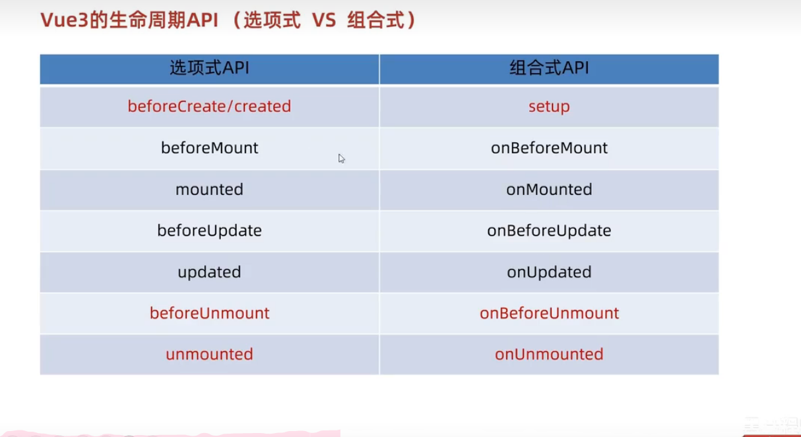
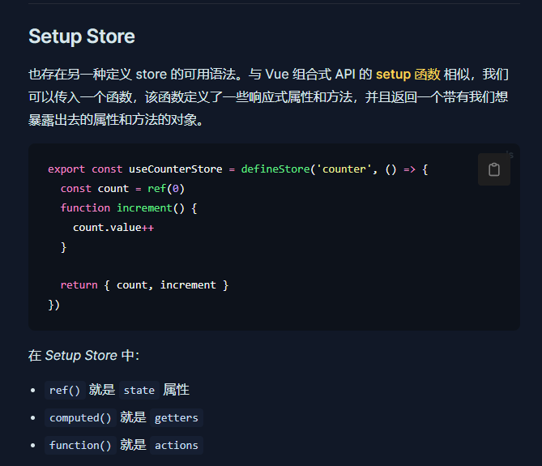

## vue3
### vue3 如何创建启动项目
创建：
1. 使用vite构建npm create vite@latest
2. 使用vue-cli构建npm init vue@latest  


启动:(去看项目总的package.json的scripts)  
1. vite:npm run serve
2. vue-cli:npm run dev
### 组合式API
#### setup
```vue
<script>
  export default {
    setup(){
      
    },
    beforeCreate(){
      
    }
  }
</script>
```
执行时机
在beforeCreate钩子之前执行,setup获取不到this   
setup里面可以写数据可以写函数，要想在外面的{{}}用，需要return   
语法糖：script旁边写setup就不要return了
```vue
<script setup>
  const message = 'this is message'
  const logMessage = ()=>{
    console.log(message)
  }
</script>
```
#### reactive
默认没有响应式数据，用reactive包裹的对象变为响应式
```vue
<script setup>
 // 导入
 import { reactive } from 'vue'
 // 执行函数 传入参数 变量接收
 const state = reactive({
   msg:'this is msg'
 })
 const setSate = ()=>{
   // 修改数据更新视图
   state.msg = 'this is new msg'
 }
</script>

<template>
  {{ state.msg }}
  <button @click="setState">change msg</button>
</template>
```
#### ref 接收简单类型或者对象类型
简单类型的响应式呢？
```vue
<script setup>
 // 导入
 import { ref } from 'vue'
 // 执行函数 传入参数 变量接收
 const count = ref(0)
 const setCount = ()=>{
   // 修改数据更新视图必须加上.value
   count.value++
 }
</script>

<template>
  <button @click="setCount">{{count}}</button>
</template>
```
在脚本区域(script)里访问数据要用.value，非脚本不用加，底层还是reactive，以后统一用ref
#### computed
```vue
<script setup>
 // 导入
 import { ref } from 'vue'
 // 执行函数 传入参数 变量接收
 const count = ref(0)
 const setCount = ()=>{
   // 修改数据更新视图必须加上.value
   count.value++
 }
</script>

<template>
  <button @click="setCount">{{count}}</button>
</template>
```
计算只有计算，避免修改计算的值
#### watch
侦听多个数据
```vue
<script setup>
  // 1. 导入watch
  import { ref, watch } from 'vue'
  const count = ref(0)
  // 2. 调用watch 侦听变化
  watch(count, (newValue, oldValue)=>{
    console.log(`count发生了变化，老值为${oldValue},新值为${newValue}`)
  })
</script>
```
侦听多个数据
> 侦听多个数据，第一个参数可以改写成数组的写法

```
<script setup>
  // 1. 导入watch
  import { ref, watch } from 'vue'
  const count = ref(0)
  const name = ref('cp')
  // 2. 调用watch 侦听变化
  watch([count, name], ([newCount, newName],[oldCount,oldName])=>{
    console.log(`count或者name变化了，[newCount, newName],[oldCount,oldName])
  })
</script>
```
> 通过watch监听的ref对象默认是浅层侦听的，直接修改嵌套的对象属性不会触发回调执行，需要开启deep

```vue
<script setup>
  // 1. 导入watch
  import { ref, watch } from 'vue'
  const state = ref({ count: 0 })
  // 2. 监听对象state
  watch(state, ()=>{
    console.log('数据变化了')
  })
  const changeStateByCount = ()=>{
    // 直接修改不会引发回调执行
    state.value.count++
  }
</script>

<script setup>
  // 1. 导入watch
  import { ref, watch } from 'vue'
  const state = ref({ count: 0 })
  // 2. 监听对象state 并开启deep
  watch(state, ()=>{
    console.log('数据变化了')
  },{deep:true})
  const changeStateByCount = ()=>{
    // 此时修改可以触发回调
    state.value.count++
  }
</script>

```
#### 生命周期函数
  
可以调用多次，并不会冲突
#### 父子通信
基本无变化
父传子：
1. 父组件内使用子组件的标签加属性，值不加冒号，表达式动态的加
2. 子组件接收 需要使用编译器宏函数去接收
const props=defineProps({
    car:String
})
注意，这里写在脚本里，脚本里访问值需要用props.值名，而在其他部分直接用值就可以
子传父：
1. 父组件先绑定事件监听
2. 子组件通过defineEmits编译器宏生成emit方法
`const emit =defineEmits(['事件名'])`
3. 触发自定义事件传递参数
```
const 方法名=()=>{
    emit('get-message','参数')
}
```
#### 模板引用和defineExpose
更精准获取dom元素
1. 引入ref
2. 调用ref函数得到ref对象
`const 值=ref(null)`
3. 在标签里通过ref属性去绑定
`<h1 ref="值"></h1>`
默认情况下在 `<script setup>` 语法糖下组件内部的属性和方法是不开放给父组件访问的，可以通过defineExpose编译宏指定哪些属性和方法容许访问
说明：指定testMessage属性可以被访问到
```
defineExpose({
    属性
})
```
#### project和inject跨层传递数据
1. 顶层组件通过provide('key',数据)提供数据
2. 底层组件const message=inject('key')接收数据
##### 响应式数据
顶层传递的时候 数据变为ref对象
const count=ref(100)
传count就ok了
##### 跨层传递函数
父可以传函数，子不用和父通信再改了
provide('函数名',()=>{

})
子孙可以直接调用方法，还是要接收inject一下哈
#### defineOptions
Vue 3.3 中新引入了 defineOptions 宏。顾名思义，主要是用来定义 Options API 的选项。可以用 defineOptions 定义任意的选项， props, emits, expose, slots 除外（因为这些可以使用 defineXXX 来做到）
#### defineModel(实验性)
1. 需要先导入，import{ defineModel } form 'vue'
2. 再配置
const modelValue=defineModel()//相当于props
modelValue++，可以直接修改
免去了接收props，定义emits等代码
### Pinia
Vuex的替代品

我为我对pinia的冒犯道歉，秒杀了vuex
#### 安装使用
npm install pinia
##### 基础语法 以及去定义仓库
  
这种写法已经混了所谓的state，或是actions或是getters，但是所有需要用的数据都需要return
另外 getters需要用computed函数去实现  
const xx=computed(()=>{

})
##### action 异步写法
正常写 async await都可以用，记得导入axios
##### storeToRefs
如果解构数据的话，响应式会丢失，如果我还是想要解构，就得去写一个方法
`const {count}=storeToRefs(counterStore)`
方法不用这样整，因为方法本来就不是响应式的
##### 持久化 数据保存本地
导入
export const useStore = defineStore(
  'main',
  () => {
    const someState = ref('你好 pinia')
    return { someState }
  },
  {
    persist: true,
  },
  ！！！！！！！！！！！！！在第三个参数上面加一个对象
)
更多的去看官方文档！谷歌收藏了