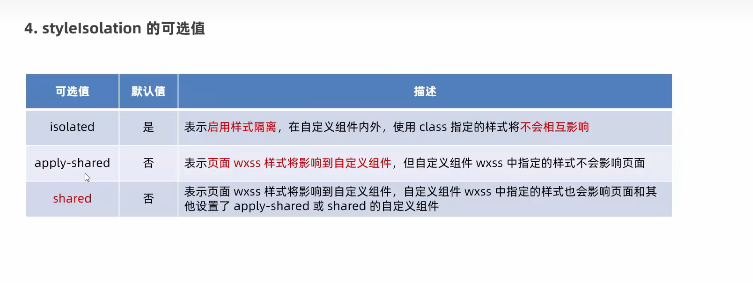

## 微信小程序的项目结构
pages 小程序的页面  
utils 工具性质模块  
app.js 小程序项目的入口文件
app.json 小程序的全局配置文件
app.wxss 小程序的全局样式样式文件
project.config.json 小程序的项目配置文件
sitemap.json 是否允许被微信索引
### WXML HTML
#### 标签
div---view  
span---text  
img---image  
a---navigator
#### 属性节点
a里面有href navigator里面有url
#### 提供模板语法
### WXSS CSS
### 新增 rpx
#### rpx
在不同大小的屏幕上自动换算
#### 全局样式与局部样式
#### 仅支持部分css选择器
### 组件
#### view
常常实现页面的布局 类似div
#### scroll-view
滚动的区域
#### swiper和swiper-item
轮播图容器组件和轮播图item组件
### scroll-view具体使用
1. 规定是横向滚动还是纵向滚动 加一个属性(scroll-x/scroll-y)
2. 加固定的宽度(横向滚动)或者固定的高度(纵向滚动)
3. 还有一些重要的属性：  
### text具体使用
1. 通过selectable属性(不用给值)，实现长摁选中文本内容的效果，其他组件不支持，只能通过手机操作
2. 类似span 行内
### rich-text 将html字符串转换
通过node属性,注意里面style用单引号
`<rich-text nodes="<h1 style='color:red'>hhhh</h1>"></rich-text>`
### button
button不加默认为普通按钮
1. type="" primary主色调按钮(绿色) warn警告按钮(红色)
2. size="mini" 变小
3. plain 不用加值，镂空
### image
1. 有src
2. 可用边框线证明image有默认的宽高
#### mode属性
1. scaleToFill(默认值)，不保持纵横比缩放图片，直至到正好填满image的默认值
2. aspectFit，保持纵横比缩放图片，使得长边显示出来，将图片完整显示出来，但是会留空白，不改变image的默认大小
3. aspectFill，保持纵横比缩放图片，使得段边显示出来，图片将会有截取，不改变image的默认大小
4. widthFix，宽度不变，高度自动变化，改变image的默认大小
5. heightFix，高度不变，宽度自动变化，改变image的默认大小
### 小程序的api
wx为最高等级的对象类似window
#### 事件监听API
以on开头，监听某些事件的触发
#### 同步API
以Sync结尾的API都是同步API
#### 异步API
需要success、fail、complete接收调用的结果
### WXML 数据绑定
1. 在页面对应的js文件中，把数据定义到data对象中
2. {{}}插值表达式插入 
#### {{}}作用 
1. 绑定数据
2. 绑定属性(与vue不同)vue不能写在属性里面，而{{}}可以
3. 可以参与运算 表达式?结果1:结果2，可以做四则运算
### WXML的事件绑定
1. bindtap 手指触摸后马上离开
2. bindinput 文本框的输入事件
3. bindchange 状态改变时触发
#### 事件的属性
当事件回调触发的时候，会收到一个事件对象event，它有一些属性
1. target 是对象 是触发事件的组件的一些属性值的集合
2. detail 是对象 额外的一些信息
3. 还有一些其他的上面两个是最重要的  
#### target和currentTarget区别
target是触发该事件的源头组件，而currentTarget则是当前事件绑定的组件,currentTarget触发的时候一般在事件冒泡   
当父组件绑定了一个点击事件，子组件被点击，通过冒泡影响到父组件，父组件的e.target是源头那个子组件，但e.currentTarget是父组件
#### bindtap的语法格式
1. 在对应的组件上添加属性为组件绑定事件`<button bindtap="触发的函数名"></button>`
2. 在页面对应的js文件中，定义事件处理函数，一般参数写成event
#### 事件处理函数中为data里面的数据赋值
在函数中，调用this.setData()方法
```js
this.setData({
    //注意如何访问data中原来的数据
    count:this.data.count+1
})
```
#### 事件传参
在事件名后面写括号加参数不行，他们会一起被解析为函数名，需要添加自定义属性，并且通过e.target.dataset.参数名访问
如果想上传字符串，不加{{}}
```js
//参数写的时候要用{{}}
<h1 bindtop="函数名" data-参数名="{{}}">hhhh</h1>"
```
#### bindinput
```js
<button bindinput="触发的函数名"></button>
//拿到输入框的值需要e.target.value
```
### 条件渲染
wx:if="{{condition}}" wx:elif="{{condition}}" wx:else，注意else不用加条件
#### 利用block控制多个组件渲染
将一个block包在一套组件的外面，用wxif去控制block
#### hidden
利用hidden也可以直接控制元素的显示隐藏`hidden="{{condition}}"`,注意true是隐藏，false是显示
#### wx:if和hidden
if是增删节点 hidden是通过css中display去控制
#### 列表渲染wx:for
wx:for="{{array}}",索引是index，当前项是item
#### 改index和item的名字
`wx:for-index="新名字" wx:for-item="新名字"`
#### wx:key
和vue一样`wx:key="id"`，注意不要加{{}}
#### rpx
将当前的屏幕在宽度上分成750px
#### 导入wxss
@import "相对路径";  
注意要用;去结尾表示结束
#### 全局样式:app.wxss与局部样式
1. 当局部样式和全局样式冲突时，根据就近原则，局部样式会覆盖样式
2. 写局部样式的权重大于或者等于全局样式的权重时，才会覆盖全局的样式，不同样式的权重不太一样，可以在wxss上面把鼠标放上面，会显示权重
### 全局配置
#### window 全局设置小程序窗口的外观
window主要是配置最上面三个点和返回键那一行和下拉时灰色那一块
##### 设置最上面标题的文字
app.json->window->navigationBarTitleText
##### 导航栏背景色
app.json->window->navigationBarBackGroundColor 不支持red等文本颜色
##### 导航栏标题颜色
app.json->window->navigationBarTextStyle 只有black和white
##### 全局开启下拉刷新(新增的)：作用所有页面
app.json->window->enablePullDownRefresh 的值设置为true
##### 下拉刷新时窗口的颜色(新增)
app.json->window->backgroundColor 只支持16进制的颜色 (带#的)
##### loading的样式(下拉刷新时的三个小圆点)
app.json->window->backgroundTextStyle 只有while和dark(灰色)两个值
##### 上拉触底的距离(新增)-一般不设置使用默认值
上拉触底就是当页面距离底部多少像素的时候会加载更多数据   
app.json->window->onReachBottomDistance
#### tabBar(新增) 导航
分为底部tabBar和顶部tabBar 里面最少2个tab标签，最多5个tab标签，当渲染顶部tabBar时，不显示icon，只显示文本
##### tabBar的6个部分
  
##### tabBar的配置项
  
注意list是必须配置的
```js
"tabBar":{
    "list":[
        {

        },
        {

        }
    ]
}
```
##### 每个tab项的配置选项
  
pathPath(pages/xxx)、text必须写
### 局部配置
冲突时 以局部配置为准 里面的配置和上面一样 注意下拉刷新效果 一般不开启全局，用局部
### 网络请求
注意事项：  
#### 发请求
wx.request()
```js
wx.request({
    url:'',
    method:'get',
    data:{
        //要发送给服务器的数据
    }
    success:(res)=>{
        //成功后调用的函数
    }
})
```
#### 页面加载就发请求
在js里面写
```js
onload:function(options){
    this.方法()
}
```
#### 跳过request合法域名校验
微信开发者工具-详情-本地设置-不校验... 仅仅在开发调试阶段使用
### 跨域和ajax
微信小程序没有跨域，跨域问题只存在于基于浏览器的web开发中，但微信小程序的宿主环境是微信客户端不是浏览器 
ajax依赖浏览器的xhr的对象，所以小程序只能叫做发起网络数据请求
### 页面导航
#### 声明式导航
使用<navigator>
##### 导航到tabBar页面
`<navigator url="/page/xx/xx" open-type="switchTab">导航到xx页面</navigator>`
注意：1. url为跳转的页面的地址，必须以/开头。 2. open-type表示跳转的方式，必须为switchTab
##### 导航到非tabBar页面
open-type改为navigate，可以完全省略
##### 从非导航页后退到上一页或者多级页面
open-type改为navigateBack 新增属性delta，数值为后退的层数，默认不写为1
#### 编程式导航
使用api后退
##### 导航到tabBar页面
```js
wx.switchTab({
    url:'/'//必须/开头
})
```
还有三个可选参数 都是回调函数，success成功回调，fail失败回调，complete调用结束的回调(成功失败都执行)
##### 导航到非tabBar页面
```js
wx.navigateTo({
    url:'/'//必须/开头
})
```
##### 从非导航页后退到上一页或者多级页面
wx.navigateBack() 里面可以传一个对象，4个参数都不是必须的，一个delta，剩下三个回调，如果不写就后退一层
#### 导航传参
在url后面添加参数url="/page/xx/xx?参数1=数据1&参数2=数据2"
### 下拉刷新
添加enablePullDownRefresh属性并将它的值设置为true，如果是全局开启下拉刷新的话，那就在app.json中添加的window项中去添加这个属性(不推荐)如果是局部那就在页面对应的json文件中去开启这个属性
#### 配置下拉窗口的样式
在局部的json文件中有两个属性，backgroundColor（仅支持16进制的颜色），backgroundTextStyle（dark和light）
#### 监听下拉刷新事件
在每个页面的js文件中有一个onPullDownRefresh函数，用来监听
#### 停止下拉刷新的效果
在处理完成监听函数之后，页面并不会还原回去而是处于一个下拉刷新的效果，这个时候我们需要调用wx.stopPullDownRefresh()来停止
### 上拉触底
上拉触底是通过上拉操作从而加载更多数据的行为
#### 监听
onReachBottom()，还要配置节流的问题
#### 上拉触底距离
这个距离指的是距离底部还有多少距离的时候触发上拉触底，微信默认的是50px，我们可以自己设置，在全局或者局部的onReachBottomDistance属性中，设置数值（不用加单位）。
#### 上拉触底的提示效果
```
wx.showLoading({
    title:'提示的文字'
})
```
注意这个不会自己消失，需要调用`wx.hideLoading()`
### 节流的控制
1. 在data里面设置一个isloading的变量，true表示现在在进行数据请求，false表示没有数据请求
2. 在上拉触底所触发的函数（不是onReachBottom）中进行设置，在开头时将isloading设置为true，在数据请求完成的complete回调函数里面，从而对数据请求进行节流控制。
3. 在onReachBottom函数中新增判断，当isloading为false的时候才能向下进行   
### 生命周期的分类
分为页面生命周期和应用生命周期，应用生命周期包括页面生命周期
#### 页面生命周期函数
在app.js里面
1. onLaunch，页面初始化完成后触发，只会触发一次，初始化一些数据
2. onShow，当小程序启动或者进入前台触发
3. onHide，当小程序进入后台触发
### wxs
wxml无法直接调用.js中的函数，但可以调用wxs中的函数，所以一般wxs充当一个过滤器的作用，在数据渲染到wxml之前对数据做一层包装
#### 与js的不同
  
#### 内嵌wxs脚本
wxs可以编写在wxml的wxs标签内，就像js能编写在html文件的script标签中，  
注意：wxml的每一个wxs标签上，必须提供moudle属性，用来指定wxs的模块名称
```vue
<view>{{m1.toUpper(username)}}</view>
<wxs module="m1">
//这里需要用module.exports.方法名 去向外暴露该方法
module.exports.toUpper=function(str){
    return str.toUpperCase()
}
</wxs>
```
#### 外联式wxs脚本
wxs也可以编写在以.wxs的后缀名的文件内
```vue
function toLower(str){
    return str.toLowerCase()
}

module.exports={
    toLower:toLower
    //注意这里不能简写
}
```
##### 使用外联wxs脚本
在wxml要引入wxs的话，需要在wxs标签上添加module属性和src属性，src必须为相对路径
#### 使用wxs时的注意事项
1. 不能作为组件的事件回调函数，如bindtap事件 它后面要接一个回调函数，但是wxs定义的函数是不能作为组件的事件回调函数的
2. wxs和js始终是两种不同的语言，wxs的运行环境和js是隔离的，且wxs不能调用js中定义的函数不能调用小程序的api
### 自定义组件
#### 创建
   
#### 引用
1. 局部引用，只能在当前页面用，在对应页面的json文件中有一个usingComponents,在里面声明一个键值对"给这个组件随便起一个名字":"/components/test/test" 这里第一个test表示test文件，第二个test表示把四个test文件整合一起形成组件
2. 在app.json全局引用，方法和上面一样
#### 组件的样式特点
组件和页面的wxss是隔离的，不会互相影响(除了一个标签选择器，所以不要用标签选择器)，但是也有需要用外部控制组件的时候，可以用以下方法去修改
  
  
#### 数据 方法 属性
1. 数据：需要定义在组件js的data属性中
2. 方法：分为事件处理函数和自定义方法 都要定义在js的methods中  
3. 数据，有data和properties，和vue不同，都是可读可写的，所以本质上他们没区别，但在使用上，更偏向于data为组件私有的数据，而prop为接受外界的数据，可以用setData去修改
```js
properties:{
    //完整写法
    max:{
        type:Number,
        value:10//默认值
    },
    max:Number//不需要默认值的简写
}
```
#### 数据监听器
某些时候，我们需要监听数据的变化，这个时候我们可以在组件的js文件中声明一个与data平级的observers
```js
observers:{
    //宏观上看是一个键值对，左侧是需要监听的数据，右侧是相应的处理函数，左侧需要引起来，监听多个数据的时候需要用逗号隔开，右侧处理函数的形参为新数据，和左侧的顺序对应
    'n1,n2':function(n1,n2){

    }
}
```
##### 数据监听器监听对象的属性
和上面区别不大  
##### 数据监听器监听对象的所有属性
如果某个对象需要被监听的属性太多，可以使用通配符**来监听对象中所有属性的变化
```js
observers:{
    //这时候右侧的形参变成了带了新值的对象
    'obj.**':function(obj){

    }
}
```
#### 组件的生命周期函数
  
##### 主要的几个函数
###### created
组件刚被创建好，不能调用setData，适合给组件的this添加自定义的属性字段
###### attached
组件初始化完毕，进入页面节点树后，适合做初始化数据的工作
###### detached
离开页面节点树后(退出一个页面后)适合做清理性质的工作
##### 声明生命周期
声明一个lifetimes节点（和data之类的同级）,在里面使用声明函数
```js
lifetimes:{
    created(){

    }
}
```
##### 组件所在页面的生命周期函数
有时候我们要通过页面来控制组件，这个时候需要利用这个,使用方式和上面的组件生命周期一样，节点的名字变成了pageLifetimes  
### 插槽
插槽是用来占位的，在不确定一个位置放什么的时候，我们可以放一个slot来占位，之后在使用组件的时候去填充内容
```js
//插槽test
<view>
    <view>我是组件内部的内容</view>
    <slot></slot>
</view>
//在wxml使用时
<test>
    <view>这是放到slot里的内容</view>
</test>
```
在组件内填充的内容将放在slot的位置，默认情况下为单个插槽
#### 多个插槽
在组件的js文件中，添加一个options，里面配置一项：multipleSlots:true;
```js
options:{
    multipleSlots:true;
}
```
多个插槽使用的时候通过name属性区分，使用插槽的时候需要使用slot属性来区分，值为name的值
```js
//插槽test
<view>
    <view>我是组件内部的内容</view>
    <slot name="before"></slot>
</view>
//在wxml使用时
<test>
    <view slot="before">这是放到slot里的内容</view>
</test>
```
### 组件通信
#### 属性绑定：父向子传递数据
页面可以看作组件的父亲，在页面中使用子组件，例如我要父组件向子组件传递一个count值，
1. 需要先写子组件，
2. 之后在子组件声明相应的属性和值例如`<test count="{{count}}"><test>`,
3. 之后去子组件的js文件中去找到properties去接收值
```js
properties:{
    count:Number
}
```
#### 自定义事件：子向父传递数据
1. 首先在父的js里定义一个方法(和data平级)，先不用方法体
2. 之后在父组件内使用子附组件并且利用自定义事件的方式将函数传给子组件
```js
//注意：bind：后的这个东西是定义的函数名，可以和之前不同，值为在父那里定义的函数名
<test bind:sync="syncCount"></test>
```
3. 在合适的时候在子组件内调用自定义函数
```js
//注意这里格式为this.triggerEvent('自定义的函数名',{可选的参数})
this.triggerEvent('sync', { value: this.properties.count })
```
4. 在父组件写的那个方法里面的参数变为e，用来接收子组件传给父组件的值，也就是上面{}里的，之后通过e.detail.value(不是非要叫value，和上面子组件传过来的数据名字有关系)来接收数据
#### 获取子组件实例：父修改子数据(父向子传递数据)
1. 利用方法来获取到子组件的实例
```js
const child=this.selectComponent('')//这里写子组件的类选择器或者id选择器
```
2. 利用child来调用子组件的方法来修改子组件内的数据
```js
child.setCount({
    count:child.properties.count+1
})
```
### behavior
组件之间存在重复的结构时，我们可以抽取共性部分称为behavior，用于共享属性、数据、生命周期函数和方法，每个组件可以引用多个behavior，behavior之间也可以相互引用
#### 创建使用
1. 首先在根目录上创建一个文件夹叫做behaviors，之后在里面创建一个js文件
2. 在该js文件里面写
```
module.exports=Behavior({
    
})
```
3. 导入
```js
//在想要引用该behavior的组件的js文件中，在Component之外的最上面，导入
const myBehavior=require("")//括号里面写想要引入的behavior的相对路径
Component({
    //将上面的实例对象引用到behaviors数组节点中
    behaviors:[myBehavior],
})
```
### vant组件库
结合文档和视频安装和学习BV1834y1676P p78
