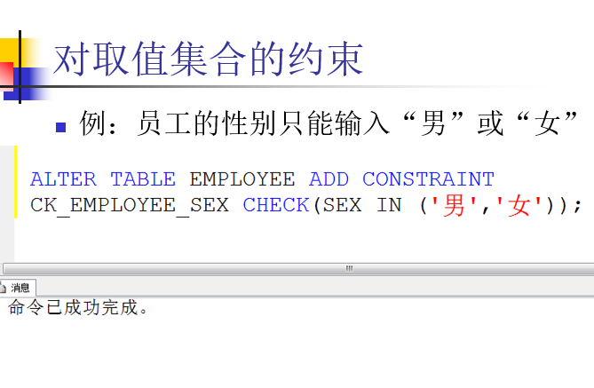

# 基本格式
select ... from ...
## 查询数量
select count(*) from 表
## 条件查询
select * from 表 where 条件1 and/or 条件2
## 内连接
select ... 
from 表
join 表 on 连接条件
## 创建视图
Create view 视图名
as
筛选语句
## 分组
在最后加上 group by 列名 如select Smajor,count(Sname) as 人数 from Student group by Smajor HAVING count(Sname)>=3;   
后面还可以加HAVING语句对分组的后的数据进行处理，与where的区别在于where处理分组之前的，HAVING处理分组后的
## 排序
在最后加order by SC.Grade desc，有desc是降序，没有是升序
## 增加数据
insert into 表名(列名)  
values(数据);  
如果这一行全有数据可以省略(列名)
## 修改数据
update 表名 set 列名=数据
## 删除
delete from 表名 where
## 存储过程
create procedure 过程名
@接收变量名 nchar(10)
as
select ...   
* CREATE PROCEDURE getinfo
    @a NCHAR(10),
    @ProjectCount INT OUTPUT,
    @TotalWorkHours INT OUTPUT
AS
    DECLARE @Count INT, @Hours INT
    SELECT 
        @Count = COUNT(*),
        @Hours = SUM(HOURS)
    FROM 
        WORKS_ON
    WHERE 
        ESSN = @a;
    SET @ProjectCount = @Count
    SET @TotalWorkHours = @Hours
## 建表
  
## 建表后创建约束
  
  

## 授权
GRANT SELECT,INSERT,DELETE,UPDATE 
ON EMPLOYEE TO TRole1
## 收回
REVOKE SELECT,UPDATE,DELETE ON EMPLOYEE FROM TRole1
### 附录
#### 一些函数
1. count()
2. len()
3. substring(列，起始位置，截取数量)
#### 关键字
1. select
2. distinct 不重复
3. and &&
4. or ||
5. not 否 在条件前面加
6. in 匹配多个值 in (1,2,3)
7. between 指定范围 between '' and ''
8. like 匹配字符串 %任意个字符 _一个字符
9. order by排序 order by 变量，默认从低到高，如果想要倒序，在后面加desc，正序是asc但是可以省略。可以用逗号隔开，再写排序的条件，例如 order by 变量1 desc,变量2;
10. all所有
11. any任意一个