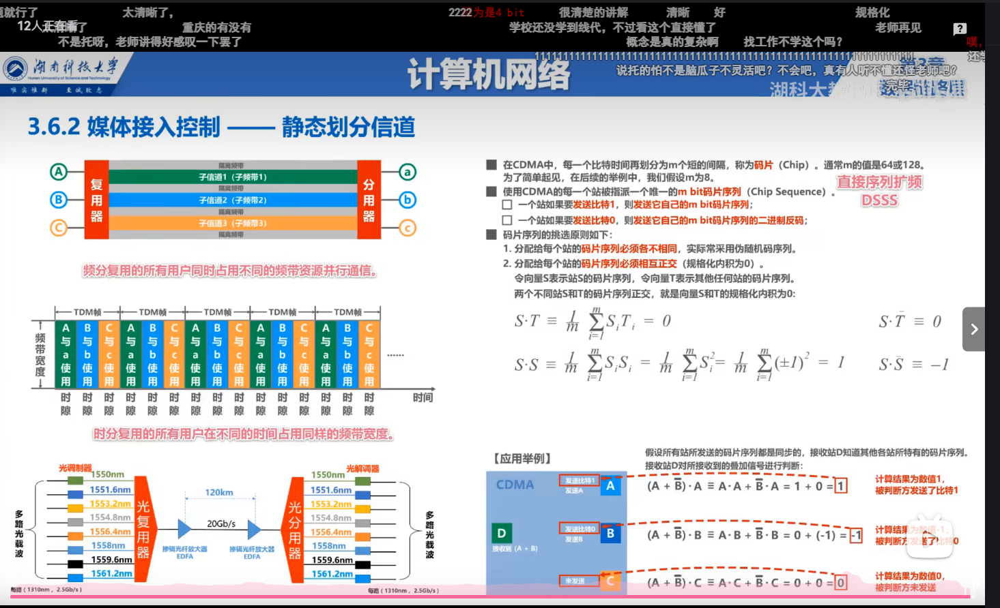
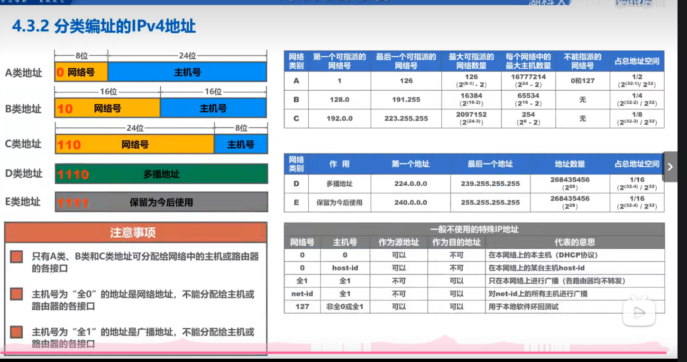

## 概述
### 3种交换方式
1. 电路交换
2. 分组交换
3. 报文交换
### 性能指标
1. 速率：b/s kb/s 单位间换算为10的3次方
2. 带宽：代表最高速率
3. 吞吐量
4. 时延：
   1. 发送时延：长度(b)/发送速率(b/s),对于长度来说1b=8bit，单位间换算为2的10次方
   2. 传播时延：信道长度(m)/传播速率(m/s)
   3. 处理时延
5. 时延带宽积：传播时延*带宽，意义是在发送的第一个比特到达终点时，发送端已经发送的比特数
6. 往返时间：RTT
## 物理层
物理层考虑的是如何在传输媒体上传输数据比特流
### 物理层下的传输媒体
1. 导引型传输媒体：物理上的各种线
2. 非导引型传输媒体：自由空间的各种光或者波
### 传输方式
#### 串行并行
1. 串行传输：远距离传输（如计算机网络）就是一串数据挨着传
2. 并行传输：计算机内部传输（cpu与内存）就是很多串数据一起发送
#### 同步异步
1. 同步传输：以字节流传输，没有间隔，接收方在字节比特的中间时刻进行检测，这样会有积累的时间误差，让双方时钟同步有两种方法：外同步：添加单独时间信号线，内同步：将时钟的信号放到发送数据中一起传输
2. 异步传输：仍然是一个字节一个字节传输，但是字节之间的时间间隔是不固定的，就是一个发出去后，可能下面马上发出去也有可能隔一段时间再发
#### 单工双工
1. 单向通信(单工)：单向传输，如广播
2. 双向交替通信(半双工)：可以双向通信但不能同时通信，如对讲机
3. 双向同时通信(全双工)：可以双向通信也可以同时通信，如电话
#### 信道的极限容量
##### 奈氏准则
码元传输速率上限：
1. 低通信道 2w 码元/秒
2. 带通信道 w 码元/秒  
w为信道带宽（Hz）
##### 香农公式
  
## 数据链路层
### 封装成帧
把上层给的数据单元添加上帧头和帧尾使之成为帧，帧头帧尾有一个重要作用是帧定界
#### 透明传输
这个意思就是上层传啥数据都行，面向字节的物理链路使用字节填充实现透明传输，面向比特的物理链路使用比特填充
### 差错检测
比特在传输时可能会产生差错，从0变1，1变0，使用差错检测码来检测数据是否产生比特差错是数据链路层一个重要的问题 
1. 奇偶校验，分为奇校验和偶校验，检验是奇数还是偶数，但是如果发生错误导致奇性或者偶性不变就不行了
#### 循环冗余校验CRC
1. 有一个多项式
2. 算出冗余码放在最后
### 可靠传输
数据链路层通过差错检测可以检测出是否产生了误码，数据链路层可以为上层提供不可靠传输服务或者可靠传输服务，不可靠仅仅丢弃有误码的帧，可靠传输服务要实现发送端发送什么，接收端就收到什么
#### 可靠传输的具体实现
注意可靠传输不止在数据链路层有应用
##### 停止-等待协议
  
##### 回退n帧协议GBN
n个停止等待协议，发送窗口从1变为最大值为n
  
##### 选择重传协议SR
一个一个确认，在GBN的基础上接收窗口从1变为最大值为n
  
### ppp协议
  
### 媒体接入控制-静态划分信道-信道复用-码分复用
  
### 媒体接入控制-动态接入控制-随机接入-CSMA/CD协议(总线局域网使用)载波监听多址接入/碰撞检测
  
### 媒体接入控制-动态接入控制-随机接入-CSMA/CA协议(无线局域网使用)载波监听多址接入/碰撞避免
  
### MAC地址(数据链路层)
主机发送数据，得带着发送主机和接收主机的地址，这个叫MAC地址   
  
### IP地址(网络层)
如果用户接入网络，只有MAC地址是不能够完全区分的，需要加上ip地址来区别  
  
### ARP协议
在数据包转发的时候，我们知道源IP地址和目的IP地址不变，而MAC地址一直在变，那数据包咋通过IP地址知道MAC地址的？这是ARP地址的作用  
  
### 集线器与交换机
集线器在物理层，遇到消息转发给所有连着的主机，交换机比较智能，工作在数据链路层(也包括物理层)，也有在网络层的，遇到消息会根据需要转发
  
### 虚拟局域网的实现
#### 交换机的端口
##### Access端口
用户连接计算机用该端口。只接收不打标签的MAC帧，根据端口给它打标签，只转发VID和端口PVID相等的帧，并且还要去标签
##### Trunk端口
用于交换机之间或者交换机与路由器之间的互连，接收：VID=PVID 去标签转发 否则直接转发，接收：接收已经打标签的帧，也接收不打标签的，之后根据端口的PVID给它打上标签，相连的Trunk端口PVID最好是一样的
## 网络层
主要任务是 实现网络互联
### IPv4地址
表示：32位每8个一组，每一组转成10进制
#### 分类编址
  
#### 划分子网
如果某单位有很多子网，但是每个子网里面的ip地址的需求又不是很多，我们可以申请一个a类(也可以是其他的)地址，之后对其进行更细致的划分，这样可以提高利用率，32位比特的子网掩码可以表示，它把2层地址变为3层，从主机号里分出来了子网号，网络号和子网号为1，主机号为0，之后与地址进行“与”运算，将网络号子网号保存下来，主机号清零
#### 无分类子网
在最后写上/网络号比特位数量
### ip数据报的发送和转发
#### 发送
先判断目的主机和自己是否在一个网络，若在一个网络属于直接交付，否则传输给主机的默认网关(路由器)，让它转发，  
如何判断是否在一个网络？  
1. 让自己的子网掩码和地址相与，获得网络地址
2. 假设目的网络和自己在一个网络里，那么用目的地址和自己的子网掩码相与得到目的网络地址
3. 如果两个网络地址相同，就在一个网络里，反之不在
#### 路由器的转发
查表，目的网络地址与表中的地址掩码相与，得到的目的网络与表中匹配就按照表中的下一跳执行即可
#### 静态(人工)配置及其可能产生的路由环路问题
  
#### 路由选择   

## 冗余码
1. 求出多项式的次数n，并将其补全写出除数（n+1位）
2. 在发送数据后面补上n个0
3. 发送数据除多项式，余数为冗余码
4. 关于检验：用发送数据(没加0的)加上冗余码除以除数，余数为0就接受，反之放弃